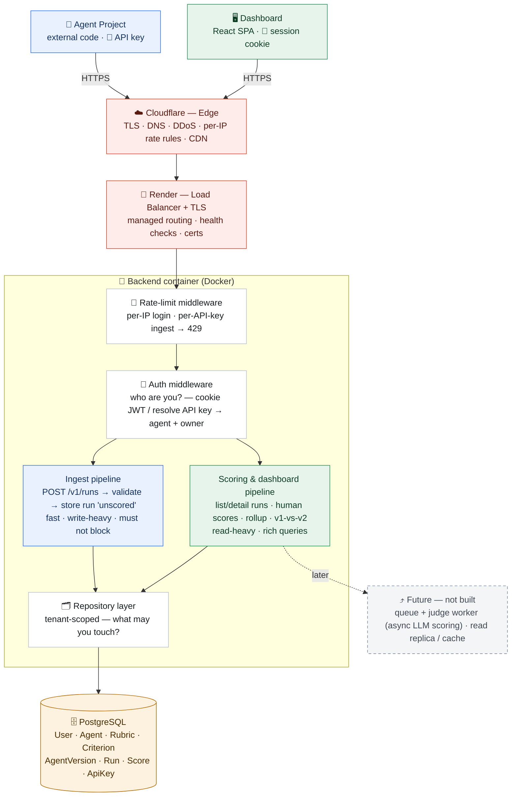
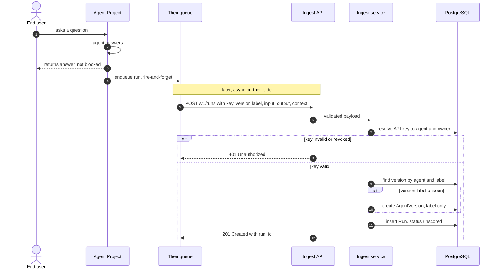
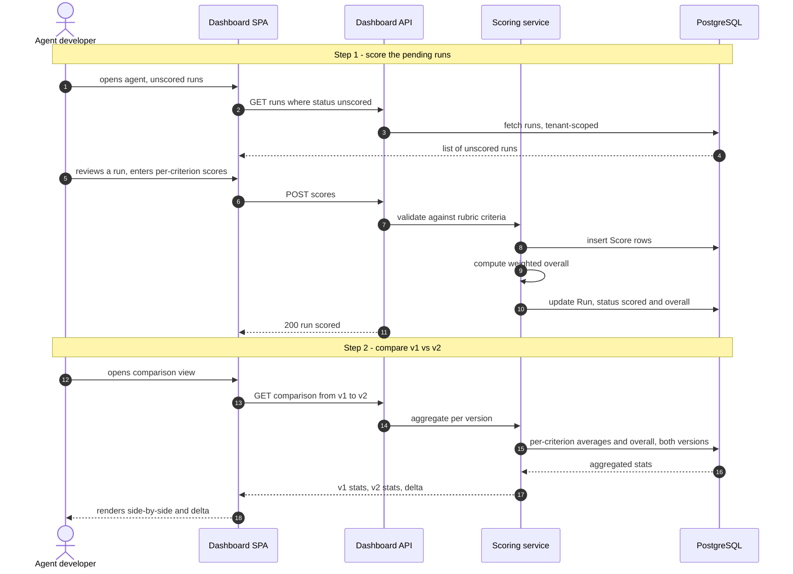

# AgentLens — High-Level Architecture

> Two entry surfaces, one shared backend. Machines **push runs** through the ingest API;
> humans **configure & score** through the dashboard API. Companion to
> [REQUIREMENTS.md](./REQUIREMENTS.md) and [CORE-ENTITIES-AND-APIS.md](./CORE-ENTITIES-AND-APIS.md).

**Legend** — 🔴 edge (managed) · 🔵 machine / ingest path · 🟢 human / dashboard path ·
⚪ backend layer · 🟠 datastore · ⬜ future (documented, not built)

## How the flow reads

A run enters **only** through the blue ingest path — the agent project lives outside AgentLens and
reaches in with its API key. Humans never touch that path; they configure agents and score runs
through the green dashboard path. Both surfaces share one backend and one database.

## Layer walk-through

**Clients.** Two callers with different natures. The **🤖 Agent Project** is external code (RAG,
multi-agent — anything) that authenticates with an **API key** and pushes runs. The **🖥️ Dashboard**
is a React SPA in the user's browser, authenticated by a **session cookie (JWT)**. This machine-vs-human
split is the organizing idea of the whole system — nearly every decision below follows from it.

**☁️ Cloudflare (edge).** The outermost layer, fronting everything. Terminates TLS, serves the SPA
over its CDN, absorbs volumetric **DDoS**, and applies **coarse per-IP rate rules** — abuse stopped
*before* it reaches the server. Managed; nothing to run.

**🔀 Render (LB + TLS).** The deploy platform's load balancer routes traffic to the container, runs
health checks, and handles certs. Also managed — you don't configure it; it's the door Cloudflare
hands requests to.

**🐳 Backend container.** A single Docker image. Every request crosses the same ordered stages:

- **🚦 Rate-limit middleware.** Fine-grained, **business-aware** limits the edge can't do: **per-IP**
  on login (anti brute-force) and **per-API-key** on ingest (anti-abuse, cost/storage bound). Two
  rate limiters is deliberate defense-in-depth — Cloudflare is coarse and IP-based and *doesn't know
  your API keys*, so per-key limits must live in the app; the app limiter is also the backstop if
  someone hits the Render URL directly, bypassing Cloudflare. In-memory now (single instance).
- **🔐 Auth middleware.** Answers **"who are you?"** — verifies the cookie JWT for dashboard requests,
  or hashes and resolves the API key to `agent + owner` for ingest requests. Invalid → 401 before any
  handler runs.
- **Split pipelines.** The system does two opposite kinds of work, kept as distinct paths. **Ingest**
  is fast, write-heavy, and must-not-block (accept → validate → store `unscored` → return).
  **Scoring & dashboard** is read-heavy and query-rich (list/detail runs, accept human scores, compute
  the weighted rollup, assemble the v1-vs-v2 comparison). Same process and DB today; separating them
  now keeps a slow comparison query from ever affecting ingest, and marks where an async worker slots
  in later.
- **🗂️ Repository layer.** All data access, **tenant-scoped** — every query bound to the authenticated
  owner. This answers the second half of security: **"what may you touch?"** (authorization).
  Deliberately at the data layer, not the middleware — auth proves *who* you are once; the repository
  enforces that you only ever see *your* rows (prevents IDOR, the #1 API risk).

**🗄️ PostgreSQL.** One relational store for all eight entities. Single region; durable ingest with
eventually-consistent reads (see [REQUIREMENTS.md](./REQUIREMENTS.md) §NFR2).

**⤴ Future (not built).** Two documented seams: a **queue + judge worker** for when async LLM scoring
replaces human scoring (ingest drops the run, a worker scores it), and a **read replica / cache** if
comparison and trend reads ever get heavy. Neither exists in stage one — scoring is a human action, so
ingest stores synchronously and there is no background worker today.

## Sequence flows

The component diagram shows *what* the pieces are; these show *what happens over time* on the two
critical paths.

### Flow 1 — Ingest a run

The agent project answers its user first, then ships the run **asynchronously on its own side** (a
queue / background job) so telemetry never blocks the user's response. AgentLens exposes a plain
synchronous endpoint; whether the client queues the call is the client's choice. On receipt the server
resolves the API key to an agent, **finds-or-creates** the version by its label (client-declared), and
stores the run as `unscored`.

### Flow 2 — Score, then compare versions

A human reviews unscored runs in the dashboard and submits per-criterion scores; the server validates
against the rubric, writes the `Score` rows, computes the weighted overall, and flips the run to
`scored`. Later the developer opens the comparison view, and the server returns **already-aggregated**
per-version stats plus the delta — the frontend just renders two columns.

